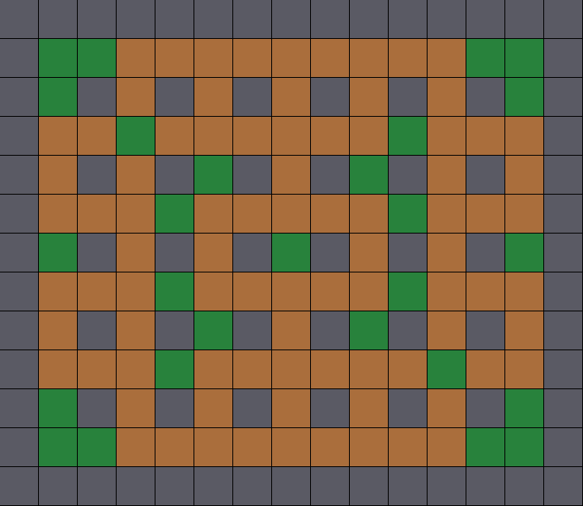

# Grille de jeu

Ce document décrit le chargement du terrain (la grille) et son affichage.



## Architecture

| Cible                | Dossier       | Dépendances            | Rôle                                                        |
|----------------------|---------------|------------------------|-------------------------------------------------------------|
| `Bomberman::grid`    | `lib/grid`    | nlohmann_json          | Modèle logique : `Position`, `Tile`, `Grid`, `GridLoader`   |
| `Bomberman::render`  | `lib/render`  | `grid`, SFML Graphics  | Affichage : `GridRenderer` (un `sf::Drawable`)              |
| `bomberman`          | `exe`         | `grid`, `render`       | Charge le niveau et ouvre la fenêtre                        |

La logique (`grid`) ne connaît pas SFML : elle reste testable sans fenêtre et pourra
être réutilisée par d'autres systèmes (collisions, IA, réseau...).

### Préparé pour la suite

- **Tuiles vs entités** : une `Tile` ne représente que le contenu statique d'une case
  (`Empty`, `Wall`, `DestructibleBlock`). Les personnages, bombes et bonus seront des
  entités positionnées sur la grille via `Position`, et dessinées par leurs propres
  renderers par-dessus le `GridRenderer` (même `getTileSize()`).
- **Explosions** : `Tile::blocksExplosion()` et `Tile::destroy()` sont déjà en place ;
  après une destruction, il suffit d'appeler `GridRenderer::update(grid)`.
- **Déplacements** : `Grid::isWalkable(position)` renvoie `false` hors grille, ce qui
  simplifie les tests de collision.
- **Joueurs** : les points d'apparition (`P` dans le fichier) sont exposés par
  `Grid::getSpawnPoints()`.

## Format d'un niveau

Les niveaux sont des fichiers JSON dans `data/grid/` :

```json
{
  "name": "Level 01",
  "width": 15,
  "height": 13,
  "rows": [
    "###############",
    "#P.+++++++++.P#",
    "..."
  ]
}
```

| Symbole | Signification                                   |
|---------|-------------------------------------------------|
| `#`     | Mur indestructible                              |
| `+`     | Bloc destructible                               |
| `.`     | Case vide                                       |
| `P`     | Point d'apparition d'un joueur (case vide)      |

Le niveau 1 suit le format conventionnel de Bomberman : 15×13 cases, soit 13×11 cases
jouables entourées de murs, des piliers sur les cases paires et un joueur dans chaque coin
avec deux cases libres pour pouvoir poser sa première bombe.

Toute incohérence (JSON invalide, champ manquant, nombre de lignes/colonnes différent de
`width`/`height`, symbole inconnu) lève une `Bomberman::GridLoadError` avec un message
explicite.

## Lancer le jeu

```bash
task conan-all
# Niveau par défaut : $BOMBERMAN_ROOT/data/grid/level_01.json (ou ./data si non défini)
./build/Release/bin/bomberman
# Ou un niveau précis
./build/Release/bin/bomberman data/grid/level_01.json
```

`Échap` ou la croix de la fenêtre ferment le jeu.

## Tests unitaires

Les tests utilisent GoogleTest (`test_requires` Conan) et sont déclarés avec le template
`bomberman_add_test` (`cmake/BombermanTest.cmake`) :

- `tests/grid` : `Tile`, `Grid`, `GridLoader` (formats invalides) et validation du niveau 1 ;
- `tests/render` : géométrie générée par `GridRenderer` (aucune fenêtre ni contexte OpenGL
  nécessaire, donc exécutable en CI).

`conan build .` lance les tests automatiquement (désactivable avec
`-c tools.build:skip_test=True`), ou après coup avec `task test`. L'option CMake
`BOMBERMAN_BUILD_TESTS=OFF` désactive leur compilation.
